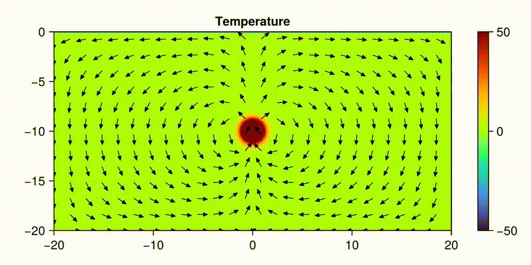
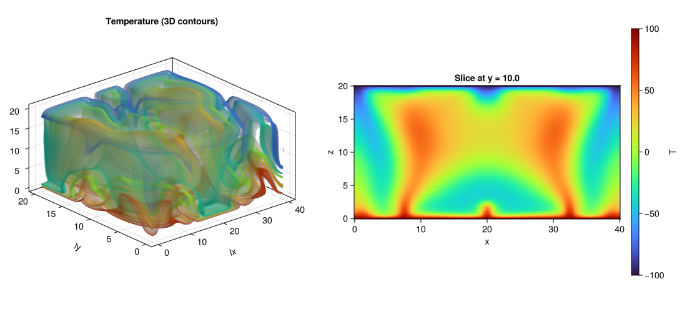
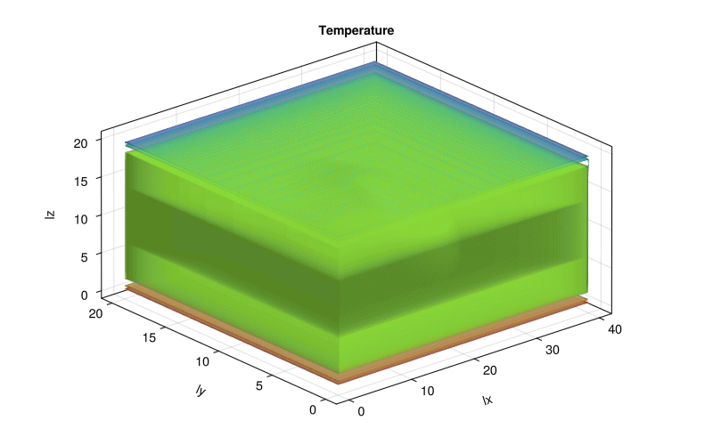
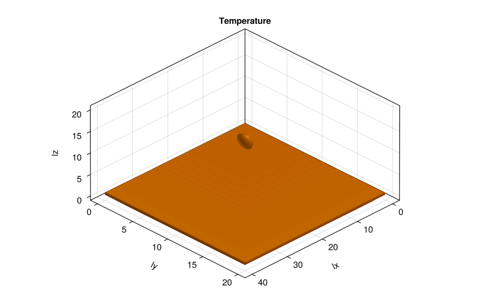
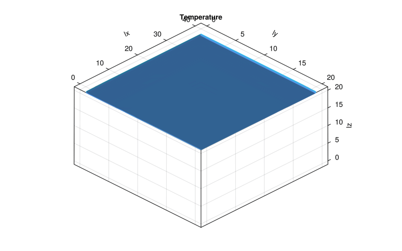

# PorousConvection

[](https://github.com/ragassler/pde-on-gpu-ramura-gassler/actions/workflows/CI.yml) | [](https://github.com/ragassler/pde-on-gpu-ramura-gassler/actions/workflows/Literate.yml)


A collection of 2D/3D porous convection solvers written in Julia, with CPU/GPU backends via [ParallelStencil.jl, ImplicitGlobalGrid]. Includes scripts for running simulations, visualization helpers, and a test suite with unit and reference tests.

## Contents

- [Introduction](#introduction/)
- [Physical model](#physical-model)
- [Numerical method and parallelisation](#numerical-method-and-parallelisation)
- [Setup](#setup)
- [Run the simulations](#run-the-simulations)
- [Repository structure](#-repository-structure)
- [2D Porous Convection (XPU)](#2d-porous-convection-xpu)
- [3D Porous Convection (XPU)](#3d-porous-convection-xpu)
- [Unit and reference testing](#unit-and-reference-testing)
- [3D MPI porous convection (XPU)](#porous-convection-3d-mpi-xpu--final-goal)
- [Automatic documentation in Julia](#automatic-documentation-in-julia)

---

## Introduction

Solving partial differential equations (PDEs) numerically is still a major challenge in scientific computing, especially when no analytical solution is available. In many realistic problems, the main limitations are **computational cost** and **code complexity**, particularly when going to 3D and high resolution.

Julia provides a nice middle ground: a high-level language with performance close to C/Fortran, and straightforward support for **multi-threading**, **GPU computing**, and **MPI**. This project demonstrates how a fairly complex physical problem – **3D thermal porous convection** – can be:

- formulated in terms of Darcy flow and heat transport,
- discretized with finite differences and upwind advection,
- solved efficiently using the **pseudo-transient method**, and
- parallelised across CPUs and GPUs using `ParallelStencil.jl` and `ImplicitGlobalGrid.jl`.

The repository contains 2D and 3D solvers, single- and multi-GPU variants, unit and reference tests, and visualization scripts to explore the resulting convection patterns.

## Physical model

We consider **thermal porous convection** in a saturated porous medium under the Boussinesq approximation.  
The unknowns are:

- Darcy flux **qᴰ(x,y,z,t)** (volume flux through pores),
- Temperature **T(x,y,z,t)** (deviation from a reference temperature),
- Pressure **p(x,y,z,t)** (deviation from a hydrostatic reference profile).

To reduce clutter, we work with:
- the **temperature diffusion flux** qᵀ instead of the Fourier heat flux qᶠ,
- deviations of pressure and temperature (not absolute values).

The *dimensional* governing equations are:

- **Darcy’s law (momentum in porous medium)**  
  \[
    \mathbf{q}_D = -\frac{k}{\eta}
    \left(\nabla p - \rho_0 \alpha g\, T \, \mathbf{e}_z\right)
  \]
  where \(k\) is permeability, \(\eta\) viscosity, \(\alpha\) thermal expansivity, and \(g\) gravity.

- **Mass conservation (incompressible flow)**  
  \[
    \nabla \cdot \mathbf{q}_D = 0
  \]

- **Heat diffusion flux**  
  \[
    \mathbf{q}_T = -\frac{\lambda}{\rho_0 c_p} \nabla T
  \]
  with \(\lambda\) thermal conductivity and \(\rho_0 c_p\) volumetric heat capacity.

- **Energy equation in porous medium**  
  \[
    \frac{\partial T}{\partial t}
    + \frac{1}{\phi} \, \mathbf{q}_D \cdot \nabla T
    + \nabla \cdot \mathbf{q}_T = 0,
  \]
  where \(\phi\) is porosity.

In dimensionless form, these equations collapse into a system governed mainly by the **Rayleigh number** \(Ra\), which controls the onset and intensity of convection. The 3D solver in this project integrates this system to steady state, starting from a localized thermal perturbation in the middle of the domain. At sufficiently high \(Ra\), this perturbation grows into rising hot plumes and sinking cold downwellings.

## Numerical method and parallelisation

### Pseudo-transient approach

The steady-state porous convection system is elliptic–parabolic and nonlinearly coupled.  
To solve it efficiently, we use a **pseudo-transient method**:

1. Add pseudo-time derivatives to the **Darcy fluxes** and **temperature fluxes**:
   - \(\theta_D \, \partial_\tau \mathbf{q}_D + \mathbf{q}_D = \text{Darcy RHS}\)
   - \(\theta_T \, \partial_\tau \mathbf{q}_T + \mathbf{q}_T = \text{diffusion RHS}\)

2. Add a pseudo-compressibility term to the **pressure equation**:
   - \(\beta \, \partial_\tau p + \nabla \cdot \mathbf{q}_D = 0\)

3. Combine **physical** and **pseudo** time derivatives in the temperature equation:
   - \(\partial_\tau T + \frac{T - T_{\text{old}}}{\Delta t} + \frac{1}{\phi}\,\mathbf{q}_D\cdot\nabla T + \nabla\cdot\mathbf{q}_T = 0\)

For each physical time step \(\Delta t\), we iterate in pseudo-time \(\tau\) until the residuals of the pressure and temperature equations fall below a tolerance. This formulation is:

- **robust** for stiff coupled systems,
- very **friendly to parallelisation**, since each pseudo-time iteration is composed of local finite-difference stencils.

### Spatial discretisation

The solver uses **finite differences (FD)** on a **staggered 3D grid**:

- Pressure and temperature are stored at **cell centres**.
- Darcy fluxes \(q_D\) and temperature fluxes \(q_T\) live on **cell faces**.
- Divergences and gradients are implemented via `ParallelStencil.FiniteDifferences3D` operators (`@d_xa`, `@d_ya`, `@d_za`).

Advection in the temperature equation uses an **upwind scheme** based on the sign of the fluxes, implemented explicitly in the kernel.

an example of a kernel function:

```julia
@parallel_indices (ix, iy, iz) function compute_dTdt!(dTdt, T, T_old, _dt, qDx, qDy, qDz, _ϕ, _dx, _dy, _dz)
    nx, ny, nz = size(dTdt)
    if (ix <= nx && iy <= ny && iz <= nz)
        dTdt[ix, iy, iz] = (T[ix+1, iy+1, iz+1] - T_old[ix+1, iy+1, iz+1]) * _dt +
                       (max(qDx[ix+1, iy+1, iz+1], 0.0) * (T[ix+1, iy+1, iz+1] - T[ix,   iy+1, iz+1]) * _dx +
                        min(qDx[ix+2, iy+1, iz+1], 0.0) * (T[ix+2, iy+1, iz+1] - T[ix+1, iy+1, iz+1]) * _dx +
                        max(qDy[ix+1, iy+1, iz+1], 0.0) * (T[ix+1, iy+1, iz+1] - T[ix+1, iy,   iz+1]) * _dy +
                        min(qDy[ix+1, iy+2, iz+1], 0.0) * (T[ix+1, iy+2, iz+1] - T[ix+1, iy+1, iz+1]) * _dy +
                        max(qDz[ix+1, iy+1, iz+1], 0.0) * (T[ix+1, iy+1, iz+1] - T[ix+1, iy+1, iz])   * _dz +
                        min(qDz[ix+1, iy+1, iz+2], 0.0) * (T[ix+1, iy+1, iz+2] - T[ix+1, iy+1, iz+1]) * _dz
                        ) * _ϕ
    end
    return nothing
end
```

Kernels are written once using `@parallel / @parallel_indices` and run efficiently on both backends.

In the multi-GPU variant `(PorousConvection_3D_multixpu.jl)`, we additionally use ImplicitGlobalGrid.jl further explained in that section.

The pseudo-transient method is particularly well-suited for this setup: each pseudo-time iteration consists of local stencil updates and nearest-neighbour communication only, which scales well across threads, GPUs, and MPI ranks.

## Setup

**Julia:** ≥ 1.9  
**Packages:** `ParallelStencil`, `Plots`, `GLMakie`, `Printf`, `Test`, `CUDA`, `JLD2`, `ImplicitGlobalGrid`

in folders : `scripts`, `Literate` and `vis_scripts_data` have their own environments activate them before running

## Run the simulations

### Locally on your own CPU

```bash
cd scripts
julia --project -e 'using Pkg; Pkg.activate("."); Pkg.instantiate(); include("PorousConvection_2D.jl")'
```

### Remotely on single/multiple GPUs (e.g. Daint CSS cluster)

Interactive session:
```bash
uenv start --view=juliaup,modules julia/25.5:v1
salloc -C'gpu' -Aclass04 -N2 --time=01:00:00  #e.g 2 Nodes (8 GPUs) for 1h

MPICH_GPU_SUPPORT_ENABLED=1 IGG_CUDAAWARE_MPI=1 JULIA_CUDA_USE_COMPAT=false srun -N2 -n8 --ntasks-per-node=4 --gpus-per-task=1 julia --project PorousConvection_3D_multixpu.jl

#modify code rerun again for 1h
```

Batch job via sbatch:

```bash
#!/bin/bash -l
#SBATCH --account=class04
#SBATCH --job-name="diff2D"
#SBATCH --output=diff2D.%j.o
#SBATCH --error=diff2D.%j.e
#SBATCH --time=01:00:00  
#SBATCH --nodes=2
#SBATCH --ntasks=4
#SBATCH --ntasks-per-node=4
#SBATCH --gpus-per-task=1

export MPICH_GPU_SUPPORT_ENABLED=1
export IGG_CUDAAWARE_MPI=1 # IGG
export JULIA_CUDA_USE_COMPAT=false # IGG

srun --uenv julia/25.5:v1 --view=juliaup julia --project PorousConvection_3D_multixpu.jl
```

## 📁 Repository Structure
```bash
├─ scripts/                               # src numerical simulation
│ ├─ Pf_diffusion_2D_perf_xpu.jl                      
│ ├─ Pf_diffusion_2D_xpu.jl  
│ ├─ Pf_diffusion_3D_xpu.jl                 
│ ├─ PorousConvection_2D_xpu_test.jl  
│ ├─ PorousConvection_2D_xpu.jl       
│ ├─ PorousConvection_3D_xpu_test.jl   
│ ├─ PorousConvection_3D_xpu.jl
│ ├─ PorousConvection_3D_mulixpu.jl
│ ├─ PorousConvection_2D.jl
├─ docs/                                   # results of the simulation
│ ├─ Results as pngs,mp4s and gifs         
├─ test/                                   # Unit and Reference tests              
│ ├─ runtests.jl                          
│ ├─ test2D.jl                              
│ ├─ test3D.jl                         
├─ vis_scripts_data                     # scripts for vis/results
└─ README.md                            # report
```

**scripts:** contain the actual source code for this project.

```bash
├─ scripts                             
│  ├─ Pf_diffusion_2D_perf_xpu.jl      # Task 8.1.2: parallel indices
│  ├─ Pf_diffusion_2D_xpu.jl           # Task 8.1.1: ParallelStencil
│  ├─ PorousConvection_2D_xpu_test.jl  # Low-res 2D + unit tests 
│  ├─ PorousConvection_2D_xpu.jl       # 2D porous convection (CPU/GPU)
│  ├─ PorousConvection_3D_xpu_test.jl  # Low-res 3D + unit tests 
│  ├─ PorousConvection_3D_xpu.jl       # 3D porous convection (CPU/GPU)
│  ├─ PorousConvection_3D_multixpu.jl  # "" MPI Multiple GPU's
│  ├─ PorousConvection_2D.jl           # Verified 2D reference (from HW5)
```
Note: The `_test.jl` variants are numerically identical to their counterparts; they differ only in parameters (grid size, time steps) and include extra helpers for unit testing.

## 2D Porous Convection (XPU)

Parallel CPU/GPU implementation of 2D porous convection with an implicit pseudo–time-stepping scheme.  
Source: `scripts/PorousConvection_2D_xpu.jl`


A small initial perturbation in the centre triggers the physical instability.  
We can observe convection developing through rising hot plumes and sinking cold downwellings.  
Global grid resolution: 1023 × 511.
### Run a simulation

- Ensure visualization is enabled in the script (Makie/Plots).
- **Local CPU (recommended for quick tests):**
  - Set `"USE_GPU"=false` (or configure inside the script).
  - Adjust resolution and number of time steps for your machine.
- **GPU on Daint:**
  - Set `"USE_GPU"=true`.
  - Reserve sufficient wall time; a production run may take ~1 hour depending on resolution.
- The simulation writes frame images (PNG) to disk.


### Make Plots
1. Download the generated frames/ directory.
2. Move it into vis_scripts_data/.
3. Run:
```bash
julia --project vis.jl
```


## 3D Porous Convection (XPU)

Parallel CPU/GPU implementation of 3D porous convection with an implicit pseudo–time-stepping scheme.  
Source: `scripts/PorousConvection_3D_xpu.jl`


Solution at the final time step (`nt = 2000`) with a global grid resolution of 255 × 127 × 127.


### Run a simulation

- Ensure visualization output is enabled if desired.
- **Local CPU:** set `ENV["USE_GPU"]=false` and reduce resolution/time steps.
- **GPU on Daint:** set `ENV["USE_GPU"]=true` and request adequate wall time (production runs can take ~1 hour depending on resolution).
- The simulation writes the final temperature field to a `.bin` file.


### Visualize 3D results
1. Download the produced .bin file.
2. Move it into vis_scripts_data/.
3. Run either:

```bash
julia --project vis_3D.jl
# or
julia --project vis_3D_slice.jl
```


## Unit and Reference Testing
[](https://github.com/ragassler/pde-on-gpu-ramura-gassler/actions/workflows/CI.yml)

We provide unit tests (kernel-level checks) and reference tests (end-to-end) for both 2D and 3D:

**Unit tests:** Validate individual kernels for correctness.

**2D reference test:** Compares the full 2D XPU simulation against the verified 2D reference solver (PorousConvection_2D.jl from HW5).

**3D reference test:** For low Rayleigh number (e.g., Ra = 10), theory predicts diffusion-dominated behavior (no convection). The test verifies that the numerical solution exhibits this regime.

To run the test go into Pkg mode run command `test`


## Porous convection 3D MPI (XPU) final goal
Parallel multi CPU/GPU MPI implementation of 3D porous convection with an implicit pseudo–time-stepping scheme. inkl. optional saving of Temperature field as .mat files for visualization  
Source: `scripts/PorousConvection_3D_multixpu.jl`


- Animation created from every 100th saved temperature field.  
- Because the initial perturbation is centred, we recover the expected symmetries in the x–z and y–z planes, as in the 2D case.  
- Local resolution per GPU: 255 × 127 × 127.  
- Global grid resolution: 508 × 252 × 252.  
- Number of time steps: 6000.

This showcases how Julia and `ImplicitGlobalGrid` make it relatively straightforward to run MPI-based multi-GPU simulations on systems like CSCS Daint.

### Modifications from the single-GPU version

This version uses `ImplicitGlobalGrid` to extend the 3D XPU solver from a **single GPU** to **multiple GPUs** via MPI:

- The global domain is decomposed into subdomains; each GPU advances its local subdomain.  
- `ImplicitGlobalGrid` handles MPI initialization and halo exchange between neighbouring subdomains.

Note: no additional numerical testing was required, since the kernel functions and discretization are unchanged.  
However, the lecture material provides reference plots; these were used for a visual reference test at lower resolution before running the final high-resolution animation.

### Run a simulation

- Ensure visualization output is enabled if desired.
- **Local CPU:** set `ENV["USE_GPU"]=false` and reduce resolution/time steps. (could take days)
- **GPU on Daint:** set `ENV["USE_GPU"]=true` and request adequate wall time (production runs can take ~6 hour depending on resolution and nt).
- The simulation writes the temperature field at verious timesteps to  `.bin` files. (optional)


### Hot plumes and cold downwellings (further visualization of the PorousConvection 3D)

<p align="center">
  
  
</p>

On the **left**, only the hottest part of the field is shown: the **top 25 % of the temperature range** (values above 75 % of the normalized temperature).  
On the **right**, only the coldest part is visualized: the **bottom 25 % of the temperature range** (values below 25 % of the normalized temperature).

### Visualize 3D results
1. Download the produced .bin files resp the folder `viz3Dmpi_out` from the cluster
2. Move it into vis_scripts_data/.
3. Run :

```bash
julia --project anim_3D.jl # anim_3D_orbit.jl for plumes and downwellings
```

## Automatic documentation in Julia

### Literate-based workflow to automatically build on GitHub using GitHub Actions
[](https://github.com/ragassler/pde-on-gpu-ramura-gassler/actions/workflows/Literate.yml)

The setup in the `Literate/` folder uses **Literate.jl** together with a GitHub Actions workflow (`Literate.yml`).  
On each run, the action calls `literate_script.jl`, which generates a Markdown file documenting how to save and load data via `.bin` files, including a small example: a random 3×3 array is written to disk, read back, and visualized as a heatmap.

