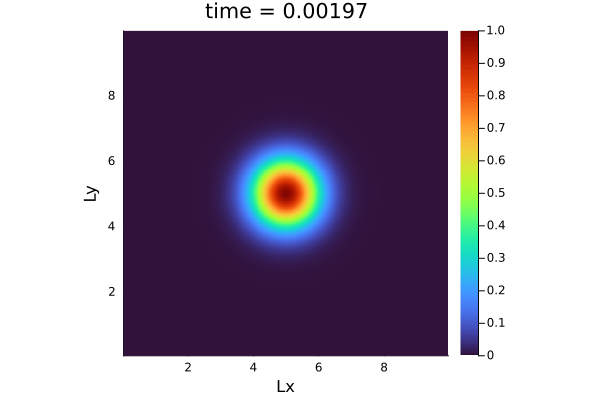
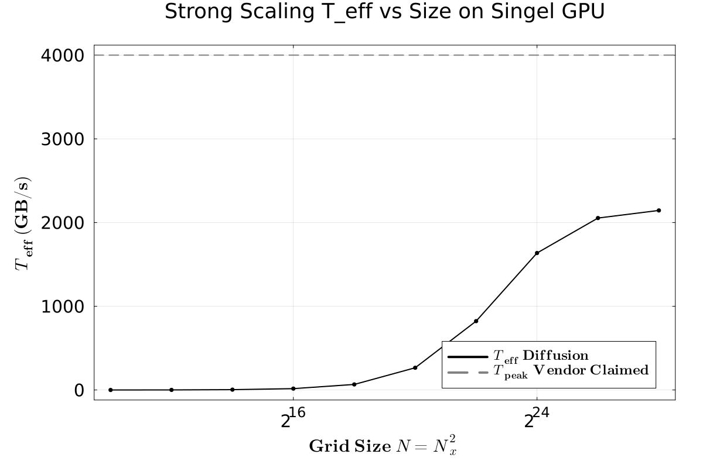
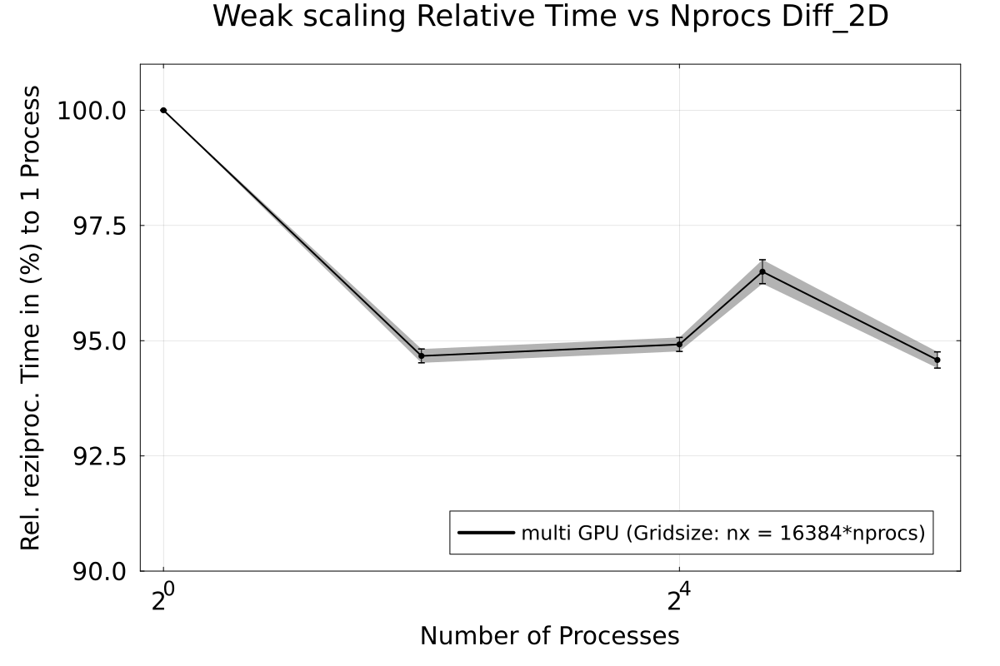
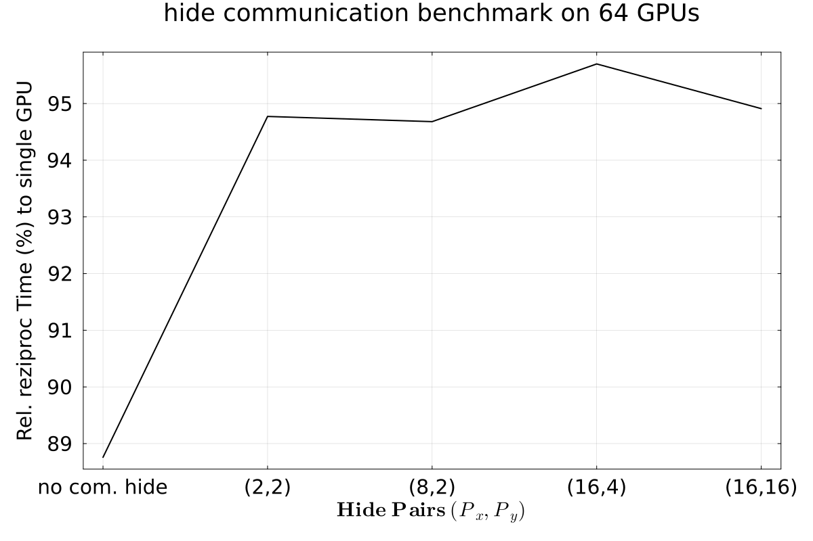

# HOMEWORK 10

Multi XPU with Implicid Grid

---

## Setup

**Julia:** ≥ 1.9  
**Packages:** `CUDA`, `Plots`, `Printf`, `Test`, `MPI`, `MAT`, `Parallel Stencil`, `Implicid Global Grid`

**using GPU's of daint for Task 2,3,4,5**

```bash
julia --project -e 'using Pkg; Pkg.activate("."); Pkg.instantiate()'

```

Note that the most part was done on daint. Not locally. 


## Task 1 

Finalizing `diffusion_2D_perf_multixpu.jl`



thats just a illustration of the Diffiuson 2D we are using to analyse 
multixpu Implicid Grid performance.


## Task 2 Verifying GPU vs CPU version

Reference testing `diffusion_2D_xpu_perf.jl` if CPU and GPU give same results.

For that run `test2d.jl`

The output:

```bash
Test Summary:                                 | Pass  Total  Time
Diffusion 2D XPU performance output file test |   21     21  1.1s
Test.DefaultTestSet("Diffusion 2D XPU performance output file test", Any[], 21, false, false, true, 1.763823808035037e9, 1.763823809160252e9, false, "/capstor/scratch/cscs/class208/temp/test2d.jl", Random.Xoshiro(0x28f1816af778031d, 0x62e77619992919d3, 0xbaf767bd483d552b, 0x2a16445fc0842432, 0x1f18c9086fc2f7cb))

```


## Task 3 Verifying Multi GPU verion

Reference testing `diffusion_2D_perf_multixpu.jl` to `diffusion_2D_perf_xpu.jl` the size of C_v and output.

For that run `test2dmultixpu.jl`

The output:
```bash
class208@daint-ln002:~/scratch/hm10> julia --project test2dmultipxu.jl 
Sizes: GPU run C size = (126, 126), MXPU run C size = (124, 124)
Test Summary:                         | Pass  Total  Time
Diffusion 2D single XPU and MXPU test |   21     21  5.8s
```


### ------------------------------------------------------------------------------------------------------------------------


# Benchmarking Multi GPU 2D Diffusion

the scripts to reproduce the results of the next tasks, can be found in `scripts/daint_benchmark_scripts ` please note that 
the plot scripts are based on the outputfiles of the last run. For reproducing the results, one has to read the times from
the output_files that the benchmark scripts produces on daint. 

To run `*_benchmark.jl` on daint use sbatch modify number of Nodes and number of tasks per node as needed:

```bash
#!/bin/bash -l
#SBATCH --account=class04
#SBATCH --job-name="diff2D_16x16_hide"
#SBATCH --output=diff2D.%j.o
#SBATCH --error=diff2D.%j.e
#SBATCH --time=02:00:00
#SBATCH --nodes=16
#SBATCH --ntasks-per-node=4
#SBATCH --gpus-per-task=1

export MPICH_GPU_SUPPORT_ENABLED=1
export IGG_CUDAAWARE_MPI=1 # IGG
export JULIA_CUDA_USE_COMPAT=false # IGG

srun --uenv julia/25.5:v1 --view=juliaup julia --project benchmark_hide.jl
```


## Task 4 Strong scaling on Single GPU




One can observe that the plateau is beginning to form at the biggest Gridsizes
That is typical for that benchmark. And it has similar T_eff as in HM7
ca. 50% to T_peak.


## Task 5 Weak scaling fixed size varying nps




The Drop resp the relative increase of wall time for multiple GPU's
Is at the beginning high. this is the Communication Overhead. as also shown later.
Afterwards the Communication can be negligable the weakskaling stayes constant.
Therefore our implementation can be scaled in Grid/nprocs = const ~> const walltime near to Single GPU.


## Task 6 Hide Communication Benchmark 




This graph shows as expected if we do not hide comm. the Communication Overhead is bigger.
We can also observe that for Nproc = 64. pair (16,4) has best performance.

