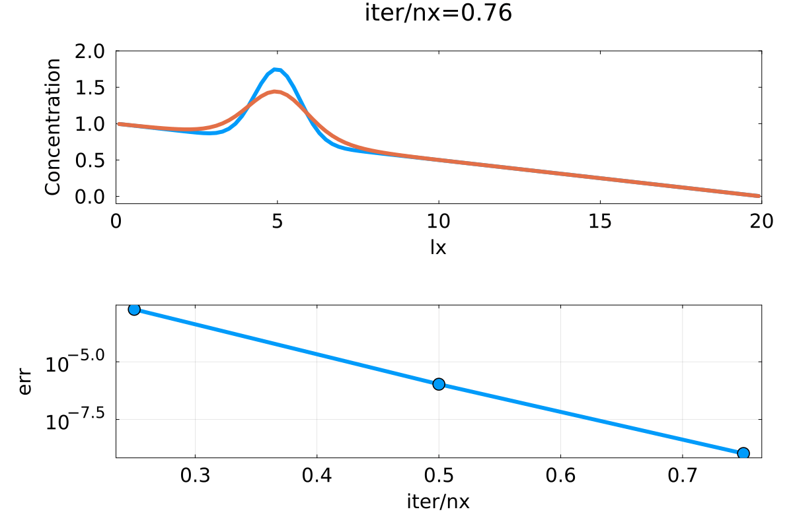

### THE SOLUTIONS TO HOMEWORK 3

TASK 1:

we can observe a fast convergence for each physical timestep.
The top plot shows as expected a diffusion of C. 

TASK 2:

here i implemented a advection step only on the interior of the domain so we have dirichet boundary conditions. Im not sure with that since boundary conditions werent mentioned in the task description. 
