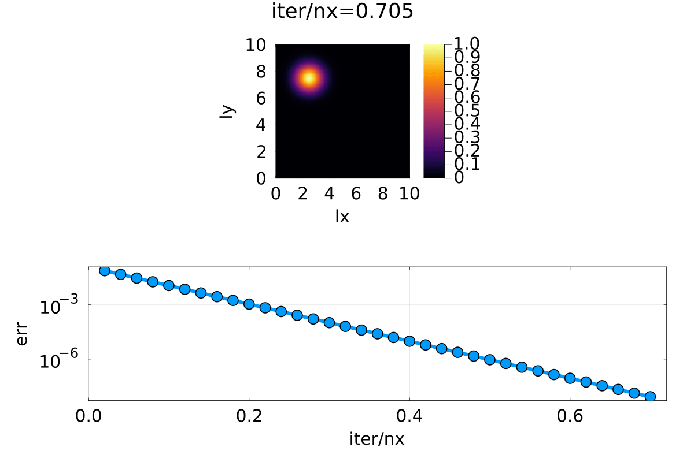
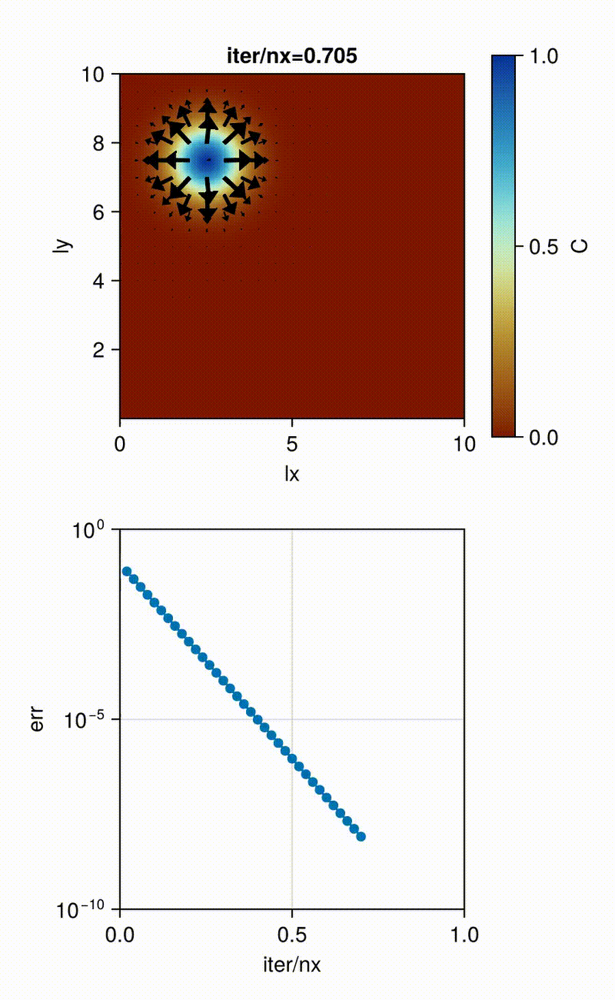

# THE SOLUTIONS TO HOMEWORK 3

### TASK 1: IMPLICIT DIFFUSION 2D


we can observe a fast convergence for each physical timestep.
The top plot shows as expected a diffusion of C. You only find advection diffusion in the scripts. To reproduce this give comment out the Advection part.


### TASK 2: IMPLICIT DIFFUSION ADVECTION 2D


### TASK 3: IMPLICIT DIFFUSION ADVECTION 2D Makie


For The Makie arrows plot i used the same nummerical scheme as in the previous task i only changed the visualization. I had to fix the limits of the axes in the second plot.

## Error computation (pseudo-transient implicit diffusion)

This solver advances diffusion implicitly via a **pseudo-transient** relaxation. Here is what “error” (residual) I report and why it’s the right quantity to monitor.

### What error do I monitor?

The **residuals** I am driving to zero are
$$
\mathcal R_C(C,\mathbf q) := \frac{C-C^{n}}{\Delta t} + \nabla\!\cdot \mathbf q,
\qquad
\mathcal R_q(C,\mathbf q) := \frac{1}{d_c}\mathbf q + \nabla C .
$$

I report the **$\infty$-norm** of the conservation residual on interior cells:
$$
\mathrm{err} = \|\mathcal R_C\|_\infty
= \max_{i,j}\Big| \tfrac{C_{i,j}-C^n_{i,j}}{\Delta t} + (\nabla\!\cdot \mathbf q)_{i,j}\Big|.
$$

> **Why is it a sum (not a max of x/y parts)?**  
> In 2D the divergence is $\partial_x q_x + \partial_y q_y$. The time term balances the **sum** of those contributions. Therefore I first form the **combined residual** and then take a norm. Taking $\max(\text{x-residual},\text{y-residual})$ would test two separate, incorrect equations.

### Discrete residual used in the code (flux form)

With a MAC grid and spacings $dx,dy$, the discrete divergence at cell centers $(2{:}n_x{-}1,\,2{:}n_y{-}1)$ is
$$
(\nabla\!\cdot \mathbf q)_{i,j} \approx 
\frac{q_x(i{+}\tfrac12,j) - q_x(i{-}\tfrac12,j)}{dx}
+ \frac{q_y(i,j{+}\tfrac12) - q_y(i,j{-}\tfrac12)}{dy}.
$$

```julia
@views begin
    divq =  diff(qx[:, 2:end-1], dims=1) ./ dx .+   # ∂x qx on centers
            diff(qy[2:end-1, :], dims=2) ./ dy      # ∂y qy on centers
    res  = (C[2:end-1, 2:end-1] .- C_old[2:end-1, 2:end-1]) ./ dt .+ divq
end
err = maximum(abs.(res))           # ∞-norm on interior