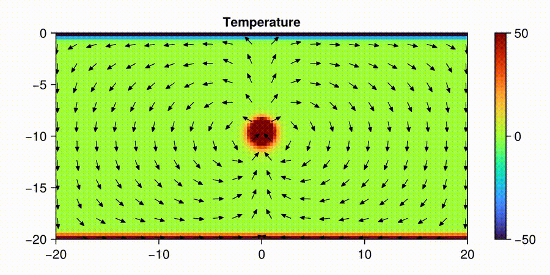
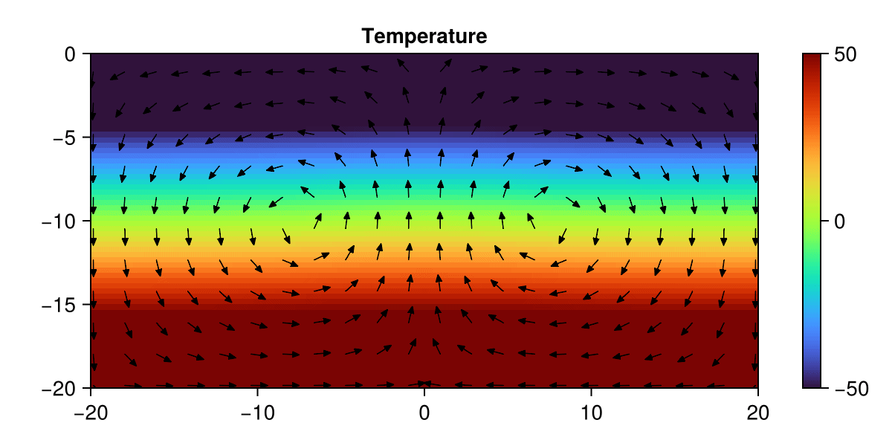
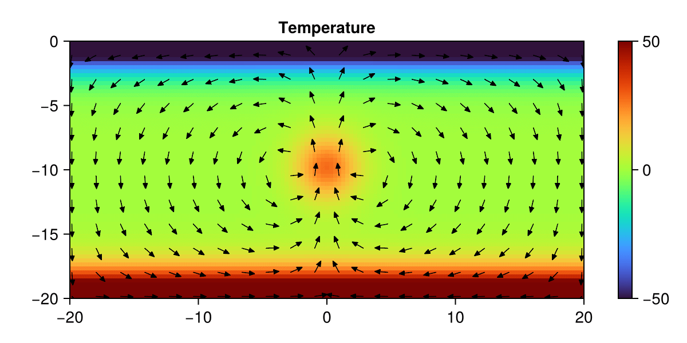
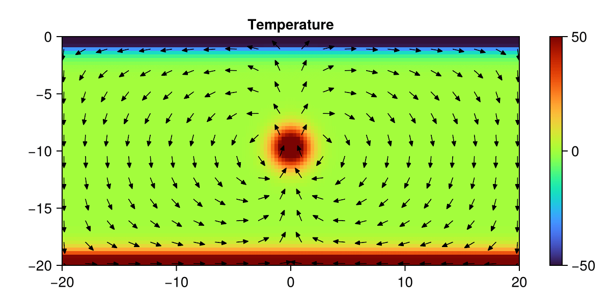
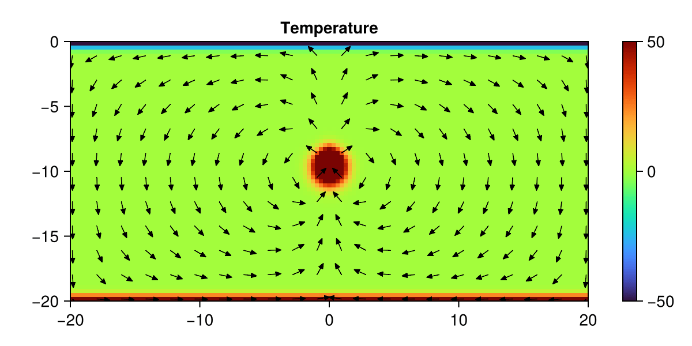

# Solutions to Homework 5

This repository contains my solutions for **HW5** on 2-D porous convection, including explicit and implicit schemes and a brief Rayleigh-number study. Visualisations were produced with **CairoMakie**.

---

## Task 1 — Porous Convection (2D, explicit T update)

The animation reproduces the qualitative behaviour shown in Task description.

---

## Task 2 — Porous Convection (2D, implicit T update)

The implicit scheme exhibits the same flow/temperature patterns as in Task 1. We see a slightly extended final time. due to larger dts.  
Convergence (reported as `iter/nx`) is typically faster: **~4 iter/nx** versus **~8 iter/nx** for the explicit update.

**Why faster?**  
- **Implicit time stepping** permits larger stable ∆t and damps high-frequency errors more effectively.  
- **Stabilisation parameters** (e.g. pseudo-relaxation radius) also affect iteration counts. 

---

## Task 3 — Rayleigh Number Analysis

A 2×2 grid of results for different Rayleigh numbers:

| Ra = 10 | Ra = 40 |
|---|---|
|  |  |

| Ra = 100 | Ra = 1000 |
|---|---|
|  |  |

**Interpretation.** With
$ \mathrm{Ra} \propto \dfrac{\text{buoyancy-driven convection}}{\text{thermal diffusion}} $

we expect:
- **Low Ra:** diffusion dominates → little/no motion.
- **High Ra:** buoyancy dominates → vigorous convection.

The simulations match these expectations: at **Ra = 10** there is essentially no convection, while at **Ra = 10^3** strong convective cells form, supporting the physical fidelity of the implementation.

---

## Notes & Reproducibility

- **Language / stack:** Julia; visualisation via CairoMakie.
- **Boundary conditions:** Side-wall adiabatic (Neumann) temperature BCs as implemented.
- **Convergence reporting:** Residuals and `iter/nx` are logged to provide a grid-scaled iteration measure.
- **Comparison tip:** When comparing explicit vs. implicit runs, use identical physical and numerical parameters (grid, Ra, stabilisation radii) to isolate the effect of time integration.
