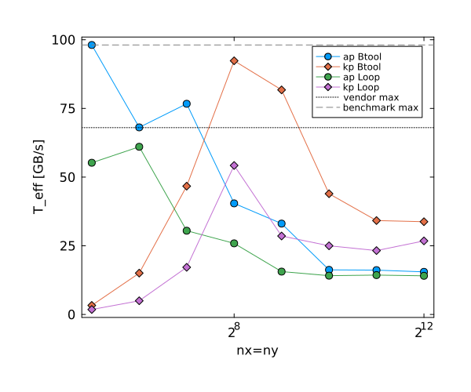
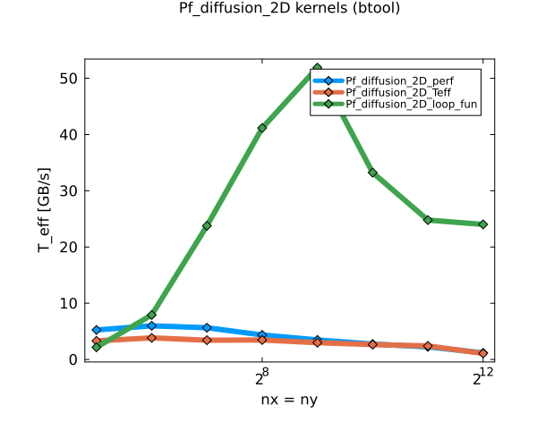

# Performance Evaluation & Unit Testing (Julia)

This repository contains my solutions for **Exercise 2 (Performance Evaluation)** and **Exercise 3 (Unit Testing)**.  
It includes reproducible Julia scripts, generated plots (PDF/PNG), and short discussions of the results.


## Setup

**Julia version:** ≥ 1.9  
**Packages:** `BenchmarkTools`, `Plots`, `LoopVectorization`, `Printf`, `Test`

```bash
julia --project -e 'using Pkg; Pkg.activate("."); Pkg.instantiate()'

```

## Exercise 2 — Performance Evaluation
### Task 1: memcopy
 Estimate sustained memory throughput using a simple memcopy(+add) kernel and relate it to the theoretical memory ceiling 




fistly we see that the btool gives better results by choosing the optimal single iteration wich was the fastest. We further can observe that for my computer we have from literature a T_peak of 128 GB/s this can be seen also from this Benchmark.

### Task 2: Pf_diffusion kernels

Benchmark effective throughput for different resolutions for multiple diffusion-kernel variants implemented in:

Pf_diffusion_2D_<variant>.jl

function Pf_diffusion_2D_<variant>(nx, ny)::Number  # returns T_eff

note that for this task since i used Btool i modified the functions by deleting the while loop. For Ex1 task1 there is the Pf_diffusion_2D_test.jl left to show my solution for this task. 

To benchmark all files i created a new file called benchmark.jl that calls all functions and performs the benchmark




The results show the expected speed up of T_eff its interessting that: - for higher resolutions the Teff and perf variants seem to be the same. 

## Exercise 3 — Unit Testing

For that i modified the function loop_fun so that it returns Pf at the desired test positions. Further I added a testset suite as following: 

```julia
### Testing with a test set for the different resolutions ###

@testset "Pressure field test" begin

    for i=1:length(nx)
        @test Pf_diffusion_2D(nx[i], ny[i])[1] ≈ Pf_n_test[i, 1]
        @test Pf_diffusion_2D(nx[i], ny[i])[2] ≈ Pf_n_test[i, 2]
        @test Pf_diffusion_2D(nx[i], ny[i])[3] ≈ Pf_n_test[i, 3] 
    end
end
```

the results of the tests: 

```bash
Test Summary:       | Pass  Total  Time
Pressure field test |   12     12  1.8s
Test.DefaultTestSet("Pressure field test", Any[], 12, false, false, true, 1.761311995306112e9, 1.76131199711006e9, false, "/home/ramura/Documents/ETH/Master/sem_1/PDEGPU/assignments/pde-on-gpu-ramura-gassler/homework-6/Pf_diffusion_2D/Pf_diffusion_2D_test.jl")

```
