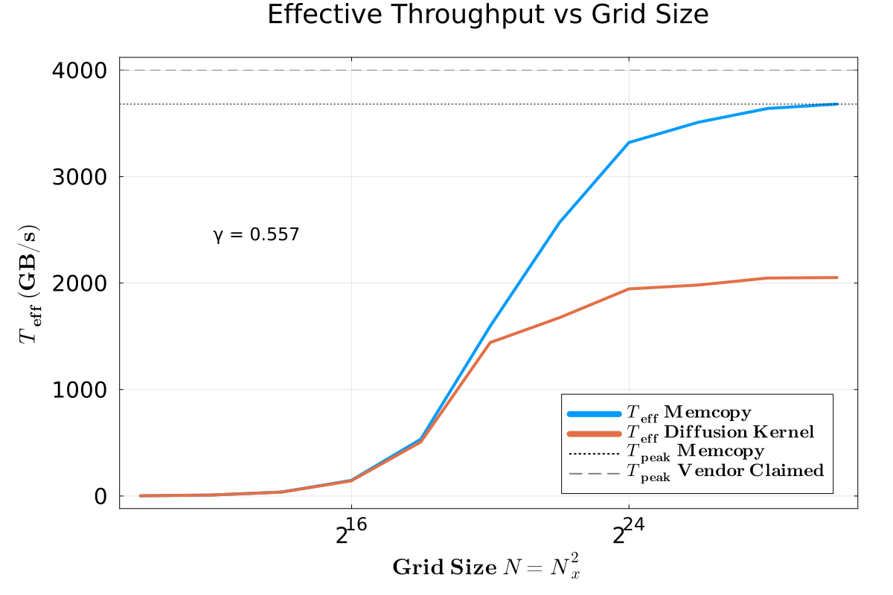

# Submission Exercise 7

This repository contains my solutions for **Exercise 1 (Jupyter)**, **Exercise 2 (Diffusion on GPU)** and **Exercise 3 (Unit Testing)**.  
It includes reproducible Julia scripts, generated plots (PDF/PNG), and short discussions of the results.


## Setup

**Julia version:** ≥ 1.9  
**Packages:** `BenchmarkTools`, `Plots`, `LoopVectorization`, `Printf`, `Test`, `CUDA`, `JLD2`

```bash
julia --project -e 'using Pkg; Pkg.activate("."); Pkg.instantiate()'

```

## 📁 Repository Structure
```bash
├─ daint_scratch
│ ├─ benchmark.jl                       # for benchmarking
│ ├─ memcopy_triad.jl                   # for benchmarking
│ ├─ Pf_diffusion_2D_loop_gpu_teff.jl   # for benchmarking
│ ├─ Pf_diffusion_2D_loop_gpu.jl        # solving PDEs on GPUs
├─ Docs
├─ L7TestingExercise                    # Ex 3: Unit and Reference test
│ ├─ scripts/                           # the srcipts to be tested
│ ├─ test/                              # test folder for runtest.jl
│ ├─ Manifest.toml   
│ ├─ Project.toml                       # activate . 
├─ test_data/                           #JLD2 files for daint->remote
├─ benchmark_plot.jl                    # plots the test_data benchmark
├─ nummerical_test.jl                   # reference test of gpu version
├─ lecture7_ex1_sub.ipynb               # solution Ex 1.
└─ README.md
```

**daint_scratch:** the daint_scratch folder has copies of the scripts which are on my scratch in the daint cluster. These are the scripts which I ran on the cluster for this weeks exercises.

## Exercise 1 — Data transfer optimisations

The submission is in the notebook: `lecture7_ex1_sub.ipynb`
The final result of that:

**T_eff / T_peak = 0.9126132603822678**

We were able to improve our implementation up to near of the vendors claimed T_peak which actually is impressive. 

## Exercise 2 — Solving PDEs on GPUs
### Task 1-2: from CPU to GPU


by following the steps from the lecture run the scripts from \daint_scratch in the \scratch on daint GPU. 
it saves a jld2 file at an save_at=int iteration point to be tested with the already tested cpu version

`nummerical_test.jl`

```bash
Maximum difference between CPU and GPU results: 8.327e-17
Test Summary:       | Pass  Total  Time
Pressure field test |    1      1  0.0s
Test passed: CPU and GPU results are approximately equal.

```


does a nummerical test to verify nummerical correctness of the gpu version. To reproduce add the jld2 to test_data folder and modify the load texts


### Task 3-4: Performance Benchmark

Benchmark effective throughput for different resolutions for diffusion on gpu compared to memcopy triad and vendors claimed max Throughput implemented in:




The benchmark behaves as expected for a memory-bound stencil: near-peak memcpy validates the platform, while the diffusion kernel reaches ca. 
56% (note thats the gamma shown in the plot) of vendor bandwidth due to inherent global-memory traffic and limited reuse. The suggested tiling/fusion strategies target data reuse and can narrow the gap toward the memcpy roof without changing the numerical scheme.

reproduceable by running the benchmark.jl script (with the two included scripts) on the cluster. it returns again a jld2 file found for my plot in test_data. which contains the times for each resolution produced by BTool.

## Exercise 3 — Unit Testing

What i did for this exercise

1. modified inline the `l2_diffusion` script with unit and reference tests
2. with Pkg generate new testing suite in `/L7TestingExercise`
3. create a folder `/L7TestingExercise/scripts`
4. Moved l2_diff_test to that folder
5. refrectored so that tests are in `/L7TestingExercise/test/runtest.jl`
6. in Pkg mode test command


```bash
(L7TestingExercise) pkg> test
     Testing L7TestingExercise
      Status `/tmp/jl_GYSEAk/Project.toml`
  [e93f01c1] L7TestingExercise v0.1.0 `~/Documents/ETH/Master/sem_1/PDEGPU/assignments/pde-on-gpu-ramura-gassler/homework-7/L7TestingExercise`
  [9a3f8284] Random v1.11.0
  [8dfed614] Test v1.11.0
      Status `/tmp/jl_GYSEAk/Manifest.toml`
  [e93f01c1] L7TestingExercise v0.1.0 `~/Documents/ETH/Master/sem_1/PDEGPU/assignments/pde-on-gpu-ramura-gassler/homework-7/L7TestingExercise`
  [2a0f44e3] Base64 v1.11.0
  [b77e0a4c] InteractiveUtils v1.11.0
  [56ddb016] Logging v1.11.0
  [d6f4376e] Markdown v1.11.0
  [9a3f8284] Random v1.11.0
  [ea8e919c] SHA v0.7.0
  [9e88b42a] Serialization v1.11.0
  [8dfed614] Test v1.11.0
     Testing Running tests...
Test Summary:       | Pass  Total  Time
Diff function tests |    2      2  0.3s
Test Summary:      | Pass  Total  Time
Diffusion 1D tests |   20     20  0.1s
     Testing L7TestingExercise tests passed 
```
