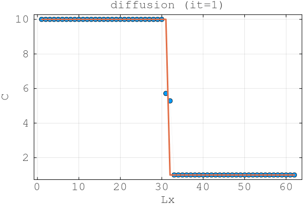
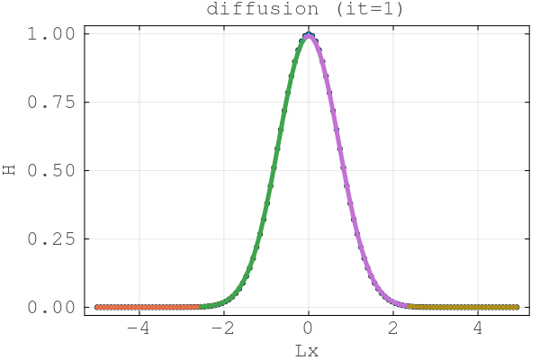
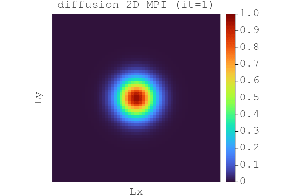

# HOMEWORK 9

Submission of Homework 9

---

## Setup

**Julia:** ≥ 1.9  
**Packages:** `CUDA`, `Plots`, `Printf`, `Test`, `MPI`, `MAT`

**using GPU's of daint for Task 3**

```bash
julia --project -e 'using Pkg; Pkg.activate("."); Pkg.instantiate()'

```

## 📁 Repository Structure
```bash
├─ scripts
│ ├─ l9_diffusion_1D_2procs.jl          # Task 1                     
│ ├─ l9_diffusion_1D_nprocs.jl          # Task 1                   
│ ├─ l9_diffusion_1D_mpi.jl             
│ ├─ l9_diffusion_2D_mpi.jl             # Task 2
│ ├─ l9_diffusion_2D_mpi_gpu.jl         # Task 3
├─ docs                                 # results of the simulation                    
├─ vis                                  # MAT data from CPU MPI local
├─ vis_gpu                              # MAT data from gpu daint 
└─ README.md                            # report
```


## Task 1 Fake Parallelization

### Task 1.1 for 2 fake parallel procs


at the beginning one can observe the Bc communication of the two different procs.

### Task 1.2 for n fake parallel procs

a typical 1D diffusion plot.


### Make Plots
1. Run:
```bash
julia --project l9_diffusion_1D_2procs.jl  # resp l9_diffusion_1D_nprocs.jl
```


## Task 2 CPU MPI Diffusion on 4 procs

### Run a simulation
```bash
~/.julia/bin/mpiexecjl -n 4 julia --project diffusion_2D_mpi.jl
```
make sure to have downloaded mpiexecjl


The Heatmap shows the expected diffusion. However for that gridsize the communication overhead is relativ huge.
Therefore we should expect a low T_eff.

### Runtime Timeloop

Time = 3.6823e-02 s, T_eff = 0.04 GB/s 

### Visualize 3D results
1. In `vizme1d.jl` change directory from `vis_gpu/mat...` to `vis/mat...` and change name of gif.
2. Run
```bash
julia --project visme2D.jl
```


## Task 3 GPU MPI Diffusion on 4 procs

### Run a simulation
copy the code into daint cluster, make sure to have all packeges 
```bash
MPICH_GPU_SUPPORT_ENABLED=1 IGG_CUDAAWARE_MPI=1 JULIA_CUDA_USE_COMPAT=false srun -N4 -n4 --ntasks-per-node=4 --gpus-per-task=1 julia --project diffusion_2D_mpi_gpu.jl
```





Since no change in the Physical and nummerical parameters and comutations, as expected same diffusion.
The runtime its even worse here for the fact that we have to copyto! host and vice versa for the halo. 


### Runtime Timeloop
Time = 2.4255e-01 s, T_eff = 0.01 GB/s 

### Visualize 3D results
1. Download vis folder from daint to local rename it to vis_gpu
2. Run
```bash
julia --project visme2D.jl
```